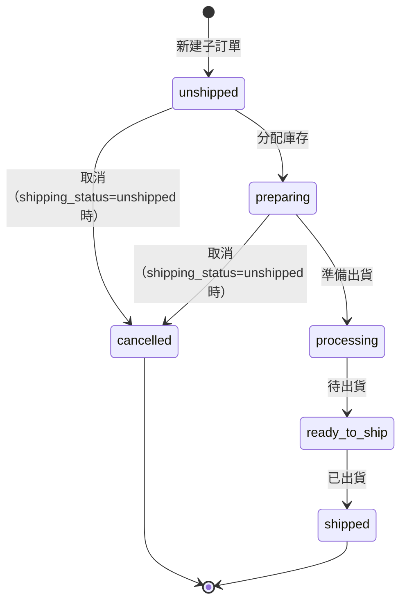

# SPEC-007: 訂單詳情頁取消商品行

| 欄位 | 值 |
|------|-----|
| 版本 | v0.1 |
| 狀態 | Active |
| 範圍 | OrderItemService, OrderFormatter, OrdersAPI |
| 相關 | ADR-003 (LINE 訂單查詢邊界) |

## 概述

從訂單詳情頁取消單一商品行（不是整個訂單）。當 admin 點擊某項商品的取消按鈕時，系統應取消對應的子訂單，並釋放該子訂單的已分配庫存。

## 介面定義

### `DELETE /wp-json/buygo-plus-one/v1/child-orders/{child_order_id}`

| 項目 | 說明 |
|------|------|
| 功能 | 取消單一子訂單 |
| 權限 | `manage_woocommerce` (Admin 權限) |
| 請求 | `DELETE /wp-json/buygo-plus-one/v1/child-orders/42` |
| 回應成功 | HTTP 200: `{ "success": true, "message": "Child order cancelled" }` |
| 回應失敗 | HTTP 422: `{ "success": false, "code": "CANNOT_CANCEL_SHIPPED", "message": "..." }` |

## DTO 定義

| DTO 名稱 | 用途 | 關鍵欄位 | 型別 | 備註 |
|---------|------|---------|------|------|
| FormattedOrderItem | 格式化訂單項 | `child_order_id`, `shipping_status`, `status` | int, string, string | 供 UI 顯示，含取消按鈕邏輯 |
| ChildOrder | 子訂單物件 | `id`, `status`, `shipping_status` | int, string, string | 資料庫層 |

## 狀態機

## 業務規則

1. **取消條件**：`shipping_status = 'unshipped'` 且 `status != 'cancelled'` 時，方可取消
2. **庫存釋放**：取消時清除 `_allocated_qty` meta，回復到可用庫存
3. **UI 顯示**：取消按鈕只在上述條件滿足時出現
4. **權限檢查**：僅 Admin 可取消
5. **已取消拒絕**：若子訂單已是 `cancelled` 狀態，API 回 422 + `ALREADY_CANCELLED`
6. **不存在拒絕**：若無該 child_order_id，API 回 404 + `NOT_FOUND`

## Changelog

| 版本 | 日期 | 變更 |
|------|------|------|
| v0.1 | 2026-04-27 | 初稿（從 archived change cancel-order-item-from-detail 反向萃取） |

---

Retrofit 產生於 2026-04-27，來源：openspec/changes/archive/2026-04-17-cancel-order-item-from-detail
