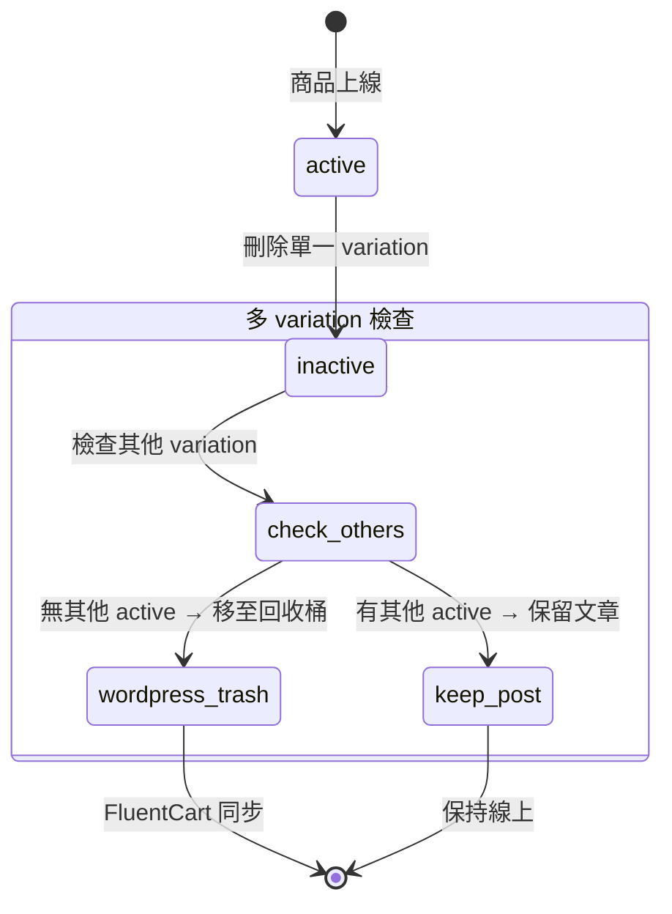

# SPEC-008: 訂單數量與 FluentCart 庫存同步

| 欄位 | 值 |
|------|-----|
| 版本 | v0.1 |
| 狀態 | Active |
| 範圍 | ProductService, ProductVariation, ProductsAPI, FluentCart 整合 |
| 相關 | ADR-001 (Shell 快取架構) |

## 概述

當 admin 刪除 BuyGo 商品或批量刪除時，系統應同步 FluentCart 的對應 WordPress 文章，將其移至回收桶（trash）。支援單一 variation 和多 variation 商品。

## 介面定義

### `POST /wp-json/buygo-plus-one/v1/products/batch-delete`

| 項目 | 說明 |
|------|------|
| 功能 | 批量刪除商品及其 variation |
| 權限 | `manage_woocommerce` |
| 請求 | `POST` with `{ "product_ids": [1, 2, 3] }` |
| 回應 | HTTP 200: `{ "success": true, "deleted": 3 }` |

## DTO 定義

| DTO 名稱 | 用途 | 關鍵欄位 | 型別 | 備註 |
|---------|------|---------|------|------|
| ProductVariation | 商品變數 | `id`, `item_status`, `post_id` | int, string, int | item_status: active / inactive |
| DeleteProductRequest | 刪除請求 | `product_ids` | int[] | 批量操作 |

## 狀態機

## 業務規則

1. **單一 variation 商品**：刪除時直接移至回收桶
2. **多 variation 商品**：僅當所有 variation 都 `inactive` 時，才移至回收桶
3. **批量刪除**：各商品獨立判定，同時執行
4. **wp_trash_post 容錯**：若 trash 失敗（文章不存在等），不應阻擋 variation 刪除，API 仍回 success
5. **批量完成**：批量操作中任何單一 variation 刪除失敗，不應影響其他
6. **靜默失敗**：wp_trash_post 錯誤不向使用者暴露，僅記錄日誌

## Changelog

| 版本 | 日期 | 變更 |
|------|------|------|
| v0.1 | 2026-04-27 | 初稿（從 archived change fix-order-quantity-and-fluentcart-delete 反向萃取） |

---

Retrofit 產生於 2026-04-27，來源：openspec/changes/archive/2026-04-17-fix-order-quantity-and-fluentcart-delete
